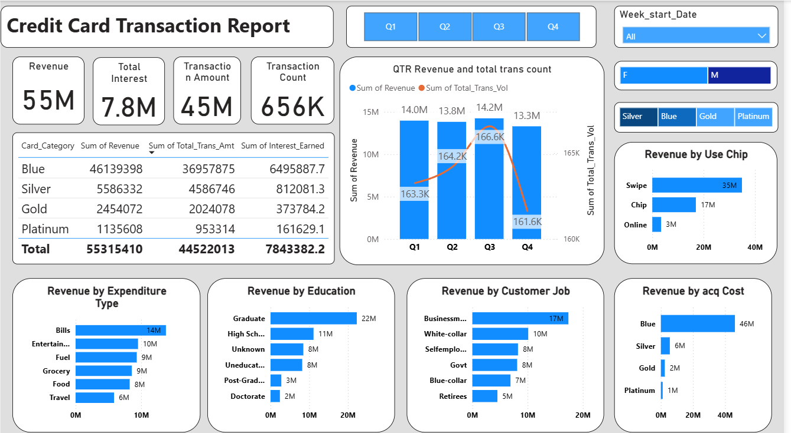

# Credit Card Transaction Report Dashboard

## 📊 Overview

This dashboard provides a detailed visualization of credit card revenue, transaction activity, and customer segmentation. It enables stakeholders to explore trends across multiple dimensions such as card category, expenditure types, customer demographics, and usage behavior.

---

## 🧩 Key Features

- **Summary KPIs**  
  View high-level metrics including:
  - Total Revenue: `55M`
  - Total Interest Earned: `7.8M`
  - Total Transaction Amount: `45M`
  - Total Transaction Count: `656K`

- **Card Category Breakdown**  
  Analyze revenue, transaction amount, and interest by card type:
  - Blue, Silver, Gold, Platinum

- **Quarterly Performance**  
  View quarterly trends in revenue and transaction volumes.

- **Customer Insights**  
  Revenue breakdown by:
  - Expenditure Type (Bills, Entertainment, Fuel, etc.)
  - Education Level
  - Job Role

- **Usage Behavior**  
  Transactions categorized by:
  - Payment method (Swipe, Chip, Online)
  - Acquisition cost per card type

- **Interactive Filters**  
  Dynamic filtering by:
  - Quarter (Q1–Q4)
  - Week start date
  - Gender
  - Card Category

---

## 🖼️ Screenshot

> _Replace the above image with your actual screenshot._

---

## 💾 Data Sources

- **Transaction Logs:** Internal credit card payment processing data  
- **Customer Data:** CRM and demographic profiles  
- **Revenue Data:** Internal financial systems calculating interest and transaction values

---

## 🛠️ Tools & Technologies

- **Visualization Tool:** Power BI (or specify Tableau, Excel, etc.)  
- **Data Source:** SQL Database / Excel / CSV (customize based on your project)  
- **Filters:** Built-in dashboard controls (slicers and selectors)

---

## 🚀 How to Use

1. Open the dashboard in Power BI or your visualization tool.
2. Use filters at the top to drill into data by:
   - Quarter
   - Week start date
   - Gender
   - Card Type
3. Explore segmented charts to gain insights into spending behavior and revenue drivers.

---

